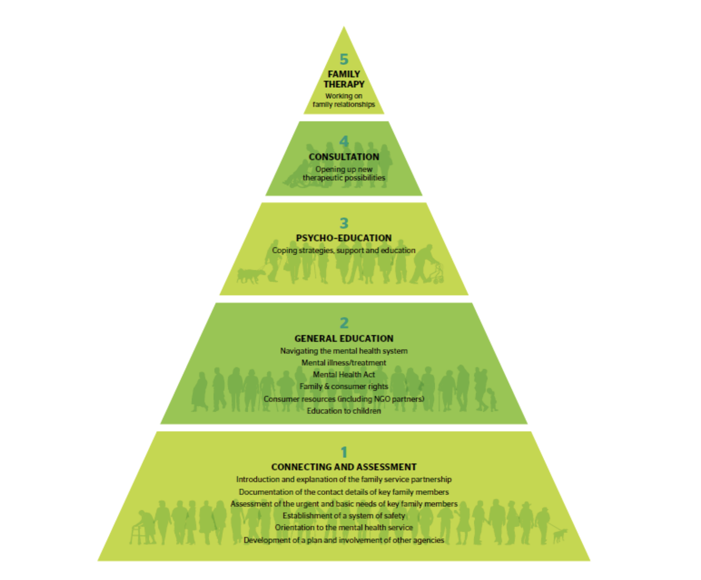

# The Pyramid of Care - An Organizing Framework
---

## Pyramid of Care

The Pyramid of Family Care provides a framework for implementing integrated and coordinated care and support for
family caregivers, based on two premises: (1) if all family caregivers have their basic needs met, then only a small
proportion will require more specialized services, and (2) it is within the scope and competence of generalist mental
health service providers to engage, assess , and address the basic needs of most family caregivers.

The Pyramid features five hierarchical levels of tasks for meeting the support needs of family caregivers. As one moves
up the pyramid, the intensity of intervention increases while the number of family caregivers who are likely to require
the intervention decreases.

At the bottom of the pyramid, Levels 1 (connection and assessment) and 2 (general education) indicate the minimum
level of service that should be available to all family caregivers. These services could be provided by mental health
service providers in the formal system and by family caregiver organizations whose primary clients are family caregivers.
The need for Level 1 and 2 interventions should be reassessed at each point of contact.

Level 3 (family psycho-education [FPE]) refers to interventions in which the family caregivers are offered coping
strategies or specific ways of dealing with the challenges of mental illness. Many family caregivers benefit from such
programs.

Level 4 (consultation) may be required by family caregivers with significant challenges in effectively supporting an adult
living with mental illness.

Level 5 (family therapy) refers to interventions aimed at creating change in the family interactional system. Few family
caregivers require Level 4 or 5.

